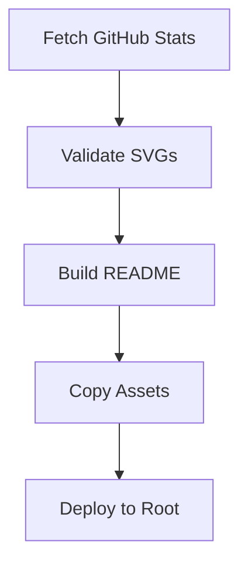

# ARCHITECTURE.md

# AYU.OS Architecture v2.0

**Version:** 2.0.0

---

# Purpose

This document describes the current architecture of the repository.
Unlike `PROJECT.md`, this file should only describe what currently exists.
Future ideas belong in `TODO.md`.
Architectural decisions belong in `DECISIONS.md`.

---

# Repository Layout

```
AyuShetty/
│
├── README.md              # Generated profile README (source of truth)
├── PROJECT.md             # Project constitution & engineering philosophy
├── ARCHITECTURE.md        # This file - current architecture
├── TODO.md                # Roadmap & task tracking
├── DECISIONS.md           # Architectural decision log
├── pyproject.toml         # Python tooling config
│
├── .github/
│   └── workflows/
│       └── build.yml      # Daily build & validation CI/CD
│
├── data/                  # ALL content lives here (single source of truth)
│   ├── profile.json       # Identity, bio, links
│   ├── skills.json        # Technical skills by category
│   ├── projects.json      # Featured & archived projects
│   ├── experience.json    # Work history & education
│   ├── research.json      # Active research areas
│   ├── objectives.json    # Current missions & milestones
│   ├── contact.json       # Contact channels
│   └── stats.json         # GitHub stats (generated at build time)
│
├── tokens/                # Design tokens (machine-readable)
│   ├── index.json         # Token registry
│   ├── colors.json        # Color palette
│   ├── spacing.json       # Spacing scale
│   ├── radius.json        # Border radius scale
│   ├── strokes.json       # Stroke widths
│   ├── typography.json    # Type scale & roles
│   ├── animation.json     # Animation semantics & timing
│   └── shadows.json       # Shadow system
│
├── components/            # SVG Component Library (Single Source of Truth)
│   ├── primitives/        # Atoms - indivisible components
│   │   ├── corner.svg     # L-bracket corner accent
│   │   ├── divider.svg    # Horizontal rule
│   │   ├── chip.svg       # Status indicator pill
│   │   ├── badge.svg      # Compact label
│   │   ├── grid.svg       # Background grid pattern
│   │   ├── panel.svg      # Base panel container
│   │   └── icons/         # 64x64 semantic icons
│   ├── layouts/           # Molecules - composed from primitives
│   │   ├── panel.svg      # Full panel with header/body/footer
│   │   ├── window.svg     # Window with titlebar & controls
│   │   ├── terminal.svg   # Terminal emulator view
│   │   ├── header.svg     # Section header
│   │   ├── navigation.svg # Tab/nav component
│   │   └── sidebar.svg    # Sidebar navigation
│   └── features/          # Organisms - complete UI sections
│       ├── mission-control.svg  # Module status dashboard
│       ├── kernel-status.svg    # Kernel info & subsystems
│       ├── project-card.svg     # Project showcase card
│       └── timeline-entry.svg   # Experience timeline row
│
├── templates/             # Build templates
│   ├── svg/
│   │   ├── section-header.svg  # Parameterized section header
│   │   └── boot-sequence.svg   # Boot animation
│   └── (future: markdown templates)
│
├── scripts/               # Build automation (stdlib only)
│   ├── build.py           # Main orchestrator
│   ├── fetch_stats.py     # GitHub GraphQL stats fetcher
│   ├── validate_svgs.py   # SVG validation
│   └── optimize_svgs.py   # SVGO optimization (placeholder)
│
├── dist/                  # Build output (gitignored)
│   ├── README.md
│   └── assets/
│       ├── primitives/
│       ├── layouts/
│       └── features/
│
├── assets/                # Runtime assets for GitHub rendering (copied from dist)
│   ├── primitives/
│   ├── layouts/
│   └── features/
│
└── docs/                  # Engineering documentation
    ├── DESIGN_LANGUAGE.md
    ├── TOKENS.md
    ├── COMPONENT_SPEC.md
    ├── SVG_GUIDELINES.md
    ├── COMPONENT_LIBRARY.md
    ├── ANIMATION_SYSTEM.md
    ├── SVG_SPEC.md
    ├── MODULES.md
    ├── ROADMAP.md
    ├── CHANGELOG.md
    └── VOICE.md
```

---

# Repository Components

## README.md
Public-facing GitHub profile.
**Generated** from `data/*.json` + `components/*.svg` by `scripts/build.py`.
Never edit manually — changes will be overwritten.

## PROJECT.md
Defines repository philosophy.
Contains AI instructions.
Acts as the engineering constitution.

## ARCHITECTURE.md
Documents current repository architecture.
Always reflects reality.

## TODO.md
Tracks planned features and milestones.

## DECISIONS.md
Stores architectural decisions with context, reasoning, alternatives.

---

# Data Layer

All content is stored in `data/*.json` files.
No content lives in templates or scripts.
This ensures:
- Single source of truth
- Easy content updates without code changes
- Type-safe validation via JSON Schema (future)
- Content reviewable in PRs

### Data Files

| File | Purpose |
|------|---------|
| `profile.json` | Name, title, bio, location, links |
| `skills.json` | Categorized skills with proficiency |
| `projects.json` | Featured projects with metadata |
| `experience.json` | Timeline of roles & education |
| `research.json` | Active research areas |
| `objectives.json` | Current missions with progress |
| `contact.json` | Contact channels |
| `stats.json` | GitHub metrics (generated daily) |

---

# Component System (AYU.UI)

Hierarchy: **Primitives → Layouts → Features**

### Primitives (Atoms)
Indivisible, reusable, no dependencies.
- `corner.svg` — 24px L-bracket accent
- `divider.svg` — horizontal rule
- `chip.svg` — status pill (dot + label)
- `badge.svg` — compact label
- `grid.svg` — 4px/32px background grid
- `panel.svg` — base container with corners
- `icons/*.svg` — 64x64 semantic icons

### Layouts (Molecules)
Composed from primitives, content-agnostic.
- `panel.svg` — full panel (header, body, footer)
- `window.svg` — OS-style window
- `terminal.svg` — terminal view
- `header.svg` — section header
- `navigation.svg` — tab bar
- `sidebar.svg` — vertical nav

### Features (Organisms)
Complete UI sections composed from layouts.
- `mission-control.svg` — 8-module status grid
- `kernel-status.svg` — version, uptime, subsystems
- `project-card.svg` — project showcase
- `timeline-entry.svg` — experience row

### SVG Standards (Enforced by `validate_svgs.py`)
Every SVG must:
- Validate as XML
- Have `viewBox` attribute
- Have `role="img"`
- Contain `<title>` and `<desc>` for accessibility
- Contain `<style>` block with design tokens
- Use meaningful IDs (kebab-case, semantic)
- Use grouped layers (`<g id="...">`)

### Coordinate Systems
- Primitives: `64x64` (icons), `200x60` (chips/badges), `1000x500` (panels/grids)
- Layouts: `1000x500` (panels), `1200x700` (windows)
- Features: `1000x600` (mission-control), `1000x300` (kernel-status), `1000x200` (project-card)

---

# Design Tokens

Single source of truth in `tokens/*.json` (machine-readable).
All values referenced by name, never hardcoded in SVGs.

| Category | File | Example |
|----------|------|---------|
| Colors | `colors.json` | `bg.100`, `fg.primary`, `accent.primary` |
| Spacing | `spacing.json` | `space.4` (16px), `space.8` (32px) |
| Radius | `radius.json` | `radius.lg` (12px) |
| Strokes | `strokes.json` | `stroke.default` (1.5px) |
| Typography | `typography.json` | `type.body`, `type.heading` |
| Animation | `animation.json` | `anim.pulse`, `anim.scan` |
| Shadows | `shadows.json` | `shadow.md`, `shadow.glow.md` |

---

# Build Process



### Steps
1. **Fetch Stats** — `fetch_stats.py` calls GitHub GraphQL API → `data/stats.json`
2. **Validate** — `validate_svgs.py` checks all SVGs in `components/`
3. **Build** — `build.py` renders README from data + component SVGs
4. **Copy Assets** — Component SVGs → `dist/assets/` → `assets/`
5. **Deploy** — Copy `dist/README.md` → root `README.md`

### Automation
- **Daily scheduled** (02:00 UTC): Full rebuild with fresh stats
- **On push to data/**: Rebuild without stats fetch
- **PR validation**: Validates JSON + SVGs, test build

---

# Design System

AYU.OS follows a component-first architecture.

**Principles:**
- Every interface assembled from reusable components
- Screens are compositions, components are primitives
- Tokens drive all visual decisions
- Accessibility is a first-class requirement
- No decorative elements without purpose

---

# Technology Stack

| Layer | Technology |
|-------|------------|
| Data | JSON |
| Components | SVG (hand-authored) |
| Tokens | JSON |
| Build | Python 3.11+ (stdlib only) |
| CI/CD | GitHub Actions |
| Validation | xml.etree.ElementTree |
| Templating | Python string replacement |

No unnecessary frameworks. Simplicity wins.

---

# Design Principles

The repository prioritizes:
- Modularity
- Readability
- Maintainability
- Scalability
- Consistency
- Accessibility

Every file has a clearly defined responsibility.

---

# Current Status

| Component | Status |
|-----------|--------|
| Repository Foundation | ✅ Complete |
| Design Tokens | ✅ Complete |
| Primitive Components | ✅ Complete (13) |
| Layout Components | ✅ Complete (6) |
| Feature Components | ✅ Complete (4) |
| Data Layer | ✅ Complete (8 files) |
| Build System | ✅ Complete |
| SVG Validation | ✅ Complete |
| GitHub Actions CI/CD | ✅ Complete |
| README Generation | ✅ Complete |
| Asset Pipeline | ✅ Complete |

---

# Future Expansion

Future modules should extend the existing architecture:
- New primitives → `components/primitives/`
- New layouts → `components/layouts/`
- New features → `components/features/`
- New data → `data/*.json`

Avoid architectural rewrites. Extend, don't replace.