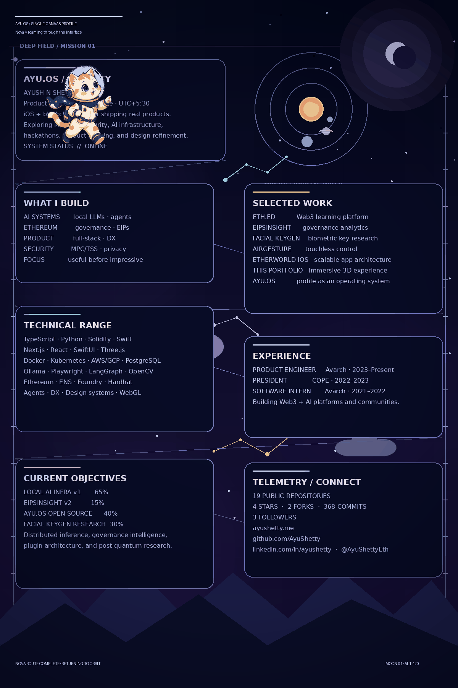

Nova, the pixel-art AYU.OS curator · slow route · walk, idle, sleep, wake, greet · <a href="assets/profile/sky-cat-still.png">static frame</a>

Open accessible text profile, links, and project details

# Ayush N Shetty
**Product Engineer** · Bangalore, India · UTC+5:30

Product engineer building local AI systems, developer infrastructure, security experiments, and calm interfaces. I care about turning difficult technical ideas into useful products with an obsessive focus on detail and design refinement.

[Portfolio](https://ayushetty.me) · [GitHub](https://github.com/AyuShetty) · [LinkedIn](https://linkedin.com/in/ayushetty) · [X](https://x.com/AyuShettyEth)

> **System status:** online. Open to interesting problems across AI infrastructure, Ethereum protocols, and developer experience.

## What I build

| Focus | Current direction |
| --- | --- |
| **AI systems** | Local LLM orchestration, browser agents, workflow automation, and human-in-the-loop tooling. |
| **Ethereum** | Governance analytics, EIP diagnostics, protocol tooling, and verifiable learning experiences. |
| **Product engineering** | Full-stack systems, developer infrastructure, design systems, and reliable delivery. |
| **Security research** | Biometric key derivation, MPC/TSS exploration, and privacy-preserving local-first systems. |

## Selected work

The strongest projects are intentionally presented as products rather than a catalogue of every experiment.

| Project | What it does | Stack | Links |
| --- | --- | --- | --- |
| **LOCAL AI INFRASTRUCTURE** | Distributed AI workflow platform using Python, Ollama, Docker, Playwright and Open WebUI for autonomous orchestration and local LLM execution across multiple systems. | `Python` · `Ollama` · `Docker` · `Playwright` · `Open WebUI` · `Kubernetes` |  |
| **[FACIAL KEYGEN — Biometric Cryptographic Key Derivation](https://github.com/AyuShetty/Facial-Keygen)** | Python-based biometric authentication system generating cryptographic keys from facial biometrics using computer vision and ML for post-quantum security research. | `Python` · `OpenCV` · `MediaPipe` · `PyTorch` · `Cryptography` · `NumPy` | [Repo](https://github.com/AyuShetty/Facial-Keygen) |
| **[AIRGESTURE — Touchless Presentation Control](https://github.com/AyuShetty/AirGesture)** | Real-time computer vision app using OpenCV and MediaPipe that translates hand gestures into presentation controls for touchless classroom interaction. | `Python` · `OpenCV` · `MediaPipe` · `PyAutoGUI` · `NumPy` | [Repo](https://github.com/AyuShetty/AirGesture) |
| **[THIS PORTFOLIO — Immersive 3D Developer Portfolio](https://github.com/AyuShetty/PortFolio)** | Immersive developer portfolio with a 3D dome gallery, scroll-driven animations, and an editorial bronze design system. Next.js + Three.js + custom design tokens. | `Next.js` · `TypeScript` · `Three.js` · `React Three Fiber` · `GSAP` · `Tailwind CSS` | [Repo](https://github.com/AyuShetty/PortFolio) · [Demo](https://ayushetty.me) |
| **[AGENTTIP — x402 Tipping Layer](https://github.com/AyuShetty/AgenTip)** | A payment layer for the internet where humans tip, AI agents pay, and creators earn USDC on Base. | `TypeScript` · `Python` · `Base` · `USDC` · `x402` · `Prisma` | [Repo](https://github.com/AyuShetty/AgenTip) |
| **[CLEARVIEW — Calm Information Systems](https://github.com/AyuShetty/clearview)** | A full-stack interface experiment for turning complex information into a clear, focused product experience. | `Next.js` · `TypeScript` · `React` · `Tailwind CSS` · `Supabase` | [Repo](https://github.com/AyuShetty/clearview) |
| **[AJAIA DOCS — Collaborative Document Systems](https://github.com/AyuShetty/ajaia-docs-ayush)** | A production-grade Google Docs-style workspace with rich text, permissions, local file parsing, seeded multi-user context, and low-latency persistence. | `Next.js` · `TypeScript` · `Rich Text` · `Supabase` · `Tailwind CSS` | [Repo](https://github.com/AyuShetty/ajaia-docs-ayush) |
| **[AYU.OS — This Profile as an Operating System](https://github.com/AyuShetty/AyuShetty)** | A fictional operating system expressed through a GitHub profile. Component-driven SVG design system, automated build pipeline, and token-based theming. | `Python` · `SVG` · `Jinja2` · `GitHub Actions` · `Design Tokens` · `SVGO` | [Repo](https://github.com/AyuShetty/AyuShetty) |

## Technical range

| Area | Tools and technologies |
| --- | --- |
| **Languages** | `TypeScript` · `Python` · `Solidity` · `Swift` · `JavaScript` · `Go` · `Rust` · `Java` · `C` |
| **Frontend & Interaction** | `Next.js` · `React` · `React Native` · `Tailwind CSS` · `Framer Motion` · `Three.js / 3D Web` · `WebGL / Shaders` |
| **Systems & Cloud** | `Docker` · `Kubernetes` · `AWS / GCP` · `Linux Systems` · `CI/CD (GitHub Actions)` · `PostgreSQL` · `Redis` · `gRPC / Protocol Buffers` |
| **AI & Local LLMs** | `Ollama` · `Playwright` · `LangGraph / LangChain` · `Local LLM Orchestration` · `Browser Automation` · `Open WebUI` · `Computer Vision (OpenCV, MediaPipe)` |
| **Blockchain & Web3** | `Ethereum Protocol` · `EIP Analysis & Tooling` · `Solidity / Smart Contracts` · `MPC / TSS Cryptography` · `ENS / ENS-based Systems` · `Foundry / Hardhat` · `Governance Analytics` |
| **Focus Areas** | `Systems Design` · `Developer Experience (DX)` · `Product Engineering` · `Autonomous AI Agents` · `Design Systems & SVG Engineering` · `IoT / Embedded (ESP32)` |

## Experience

| Role | Period | Scope |
| --- | --- | --- |
| **Product Engineer** Avarch | 2023-01 – Present | Leading product engineering for AI, infrastructure, and product platforms. Building LOCAL AI INFRASTRUCTURE for distributed local LLM inference, AgentTip payment rails, and security-focused systems. |
| **President** COPE (Community of Peer Engineers) | 2022-01 – 2023-12 | Led 200+ member student engineering community. Organized hackathons, workshops, and industry mentorship programs. Built internal tools for community management. |
| **Software Engineering Intern** Avarch | 2021-06 – 2022-12 | Early full-stack contributor across developer infrastructure, protocol tooling, and product experiments. Research on distributed systems and secure computation. |

## Current objectives

| Objective | Progress | Direction |
| --- | ---: | --- |
| **Ship LOCAL AI INFRASTRUCTURE v1.0 — Production-Ready Distributed Inference** | `65%` | Complete the distributed local LLM orchestration platform with multi-node inference, browser automation integration, and Open WebUI compatibility. Target: zero-config Docker deployment. |
| **AGENTTIP — Open Rails for Humans and AI Agents** | `15%` | Evolve AgentTip into a clearer creator and agent payment layer with reliable x402 verification, USDC settlement, and a simple integration surface. |
| **Open-Source AYU.OS Design System with Plugin Architecture** | `40%` | Extract the SVG component library, token system, and composition engine as a standalone OSS package. Enable theming, custom primitives, and framework-agnostic usage. |
| **Publish FACIAL KEYGEN Research — Biometric Key Derivation for Post-Quantum Crypto** | `30%` | Formalize the biometric-to-cryptographic-key derivation pipeline. Submit to cryptography conference. Open-source reproducible implementation with security analysis. |

## GitHub telemetry

| Metric | Snapshot |
| --- | ---: |
| Public repositories | **20** |
| Stars / forks | **4 / 2** |
| Commits in the latest period | **374** |
| Followers | **4** |

## Connect

| Channel | Link |
| --- | --- |
| **GitHub** | [AyuShetty](https://github.com/AyuShetty) |
| **Email** | [ayush@ayushetty.me](mailto:ayush@ayushetty.me) |
| **Website / Portfolio** | [ayushetty.me](https://ayushetty.me) |
| **LinkedIn** | [ayushetty](https://linkedin.com/in/ayushetty) |
| **X (Twitter)** | [@AyuShettyEth](https://x.com/AyuShettyEth) |
| **Instagram** | [ayushetty.eth](https://instagram.com/ayushetty.eth) |

---

> Shipping real products. Exploring MPC/TSS security. Code that actually scales.
>
> AYU.OS profile build **v3.0.0** · The README is generated from [`data/`](data/) and the visual system lives in [`components/`](components/).

Built with care in Bangalore. Designed to be useful before it is impressive.

