<div align="center">
  
</div>

# System Overview

**AYU.OS v7.0.0** — AYU.OS Core

Product Engineer based in India, running AYU.OS. Specialized in architecting Autonomous AI Browser Agents, Developer Infrastructure, and Ethereum Protocols from first principles.

Building clean, reliable, high-performance software with an obsessive focus on detail and design refinement.

| LOC | INDIA |
|---------|--------|
| STATUS | ACTIVE |
| ROLE | Product Engineer |
| FOCUS | Local AI & Web3 |


---

## Mission Control

### Active Modules

| Module | Status | Description |
|--------|--------|-------------|
| Kernel | active | System initialization and runtime management. |
| Mission Control | active | Active projects and career timeline. |
| AI Core | active | Reasoning engine and local LLM orchestration. |
| Research Database | active | Articles, blogs, and documentation. |
| Filesystem | active | Public repositories and subsystems. |
| Telemetry | active | GitHub statistics and system metrics. |
| Network | standby | Connections and packet routing. |
| Archive | standby | Past work and deprecated modules. |


---

## Kernel Status

### Kernel Status

```rust
pub struct Kernel {
    version: "7.0.0",
    status: "synchronized",
    uptime: "99.97%",
    memory: "stable",
    processes: "nominal"
}
```

System is fully operational. All subsystems responding within acceptable parameters.


---

## System Telemetry

- Repositories: **42**
- Stars: **1.2k**
- Commits: **3.4k**

---

## Terminal

```text
$ ayu-os init
[INFO] Kernel loaded successfully.
[INFO] Mounting filesystem...
[INFO] AI Core initialized.
[INFO] Network interface standby.
[OK] System ready.
$
```

---

---

> System initialized. All modules deployed.

Last updated: 2026-07-27 | Repository Version: v7.0.0

